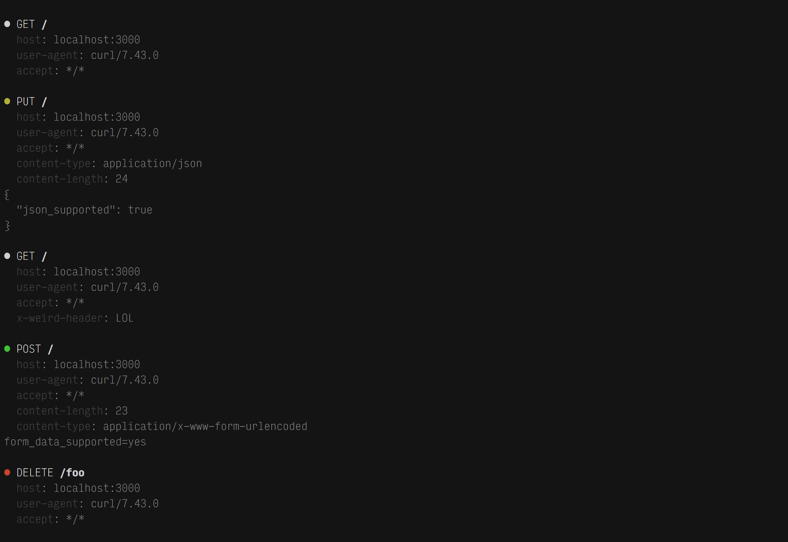

# echo

API that records, prints and returns requests you send to it.

**It has nothing to do with [Amazon Echo](https://en.wikipedia.org/wiki/Amazon_Echo), [a lazy image loader](https://github.com/toddmotto/echo), [EchoNest](http://the.echonest.com/), or other stuff called `echo`!**

## When do I need this?

Mostly for prototyping unidirectional data flow over HTTP from your web application to somewhere else. Every request is retrievable by calling `GET /_requests` (and clearable with `DELETE /_requests`), so you could use this API also for testing, I guess.

Since there is no support for mocking the response body, this API is unsuitable when your web application depends on it. (This includes every "typical" web app where you create a resource, the server answers with the newly created resource and the app renders something based on that.) For testing it's in that case better to look for something like [wiremock](http://wiremock.org/) or [mountebank](http://www.mbtest.org/) as you'll want the server to return error statuses for requests it doesn't expect.

## Usage

You'll have to clone the repo as it's not available on NPM.

Then just run `node` in its root folder.

Attention: Developed with Node 6.5, ie uses arrow functions, template strings etc.

## License

The MIT License (MIT)
Copyright (c) 2016 Nikolaus Piccolotto

Permission is hereby granted, free of charge, to any person obtaining a copy of this software and associated documentation files (the "Software"), to deal in the Software without restriction, including without limitation the rights to use, copy, modify, merge, publish, distribute, sublicense, and/or sell copies of the Software, and to permit persons to whom the Software is furnished to do so, subject to the following conditions:

The above copyright notice and this permission notice shall be included in all copies or substantial portions of the Software.

THE SOFTWARE IS PROVIDED "AS IS", WITHOUT WARRANTY OF ANY KIND, EXPRESS OR IMPLIED, INCLUDING BUT NOT LIMITED TO THE WARRANTIES OF MERCHANTABILITY, FITNESS FOR A PARTICULAR PURPOSE AND NONINFRINGEMENT. IN NO EVENT SHALL THE AUTHORS OR COPYRIGHT HOLDERS BE LIABLE FOR ANY CLAIM, DAMAGES OR OTHER LIABILITY, WHETHER IN AN ACTION OF CONTRACT, TORT OR OTHERWISE, ARISING FROM, OUT OF OR IN CONNECTION WITH THE SOFTWARE OR THE USE OR OTHER DEALINGS IN THE SOFTWARE.
